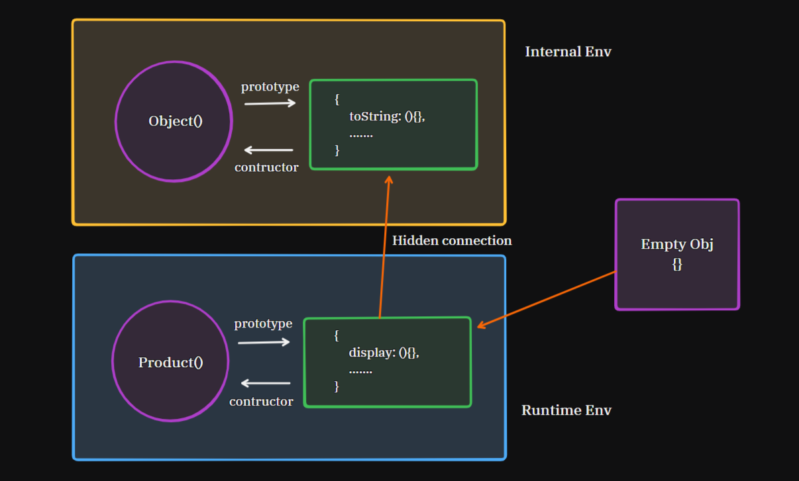

# Object-Oriented Programming (OOP) Concepts
In OOPs, we follow the concept of blueprints. We actually prepare a blueprint that is mental model of how real life entities will work. For example we have a product that have some properties like name price rating and behaviors like buy and add to wish list.
- Product
    - Properties: name, price, rating
    - Behaviors: buy, add to wish list

Here are some of the key concepts:
- **Class**: A class is a blueprint for creating objects. It defines the properties and behaviors that the objects created from the class will have.
- **Object**: An object is an instance of a class. It is created from a class and has its own unique set of properties and behaviors. You can create multiple objects from the same class each object have its own unique states.
- **Properties**: Properties are the attributes or characteristics of an object. They define the state of an object and are usually represented by variables within a class. Properties of an object helps us to uniquely identify two objects but behavior may be similar.
- **Methods**: Methods are the functions or actions that an object can perform. They define the behavior of an object and are usually defined within a class. Methods can manipulate the properties of an object or perform actions related to the object.

## Implementation in JS
In JavaScript we have class keyword by using it you can create blueprints. Here is the syntax of the class keyword:
```js
class ClassName {
    properties;
    behaviors;
}
```

- We can create real life entities by using this syntax to create and manage the entity we have `new` and `this` keywords. See the example below:
```js
class Product {
    name;
    price;
    rating;

    display(){
        console.log(this)
    }
}

// syntax to create an object
let p = new Product();
p.display(); // { name: undefined, price: undefined, rating: undefined }
```

- In the above example, we created a class `Product` with properties `name`, `price`, and `rating`. The method `display` logs the current state of the object. When we create an instance of `Product` using `new Product()`, it initializes an object with those properties set to `undefined`.

### `this` keyword
Except one case, `this` keyword always refers to the calling `site`/`context` in JavaScript, but in Java/C++ `this` keyword points to current object always.

let there are 2 objects:
```js
let iphone = {
    name: "Iphone",
    price: 100000,
    rating: 4.8,

    display(){
        console.log(this); // refers to the object calling this method
    }
}
let macbook = {
    name: "Macbook",
    price: 150000,
    rating: 4.8,

    display(){
        console.log(this); // refers to the object calling this method
    }
}

macbook.display();
```
- When you call `display()` method of `iPhone`/`Macbook` `this` keyword refers to calling site/context It can be `iPhone`/`Macbook` object.
- If you use `this` keyword in arrow function then `this` keyword is not referred to calling site or context. In arrow functions `this` keyword resolved by default by lexical scope.
```js
let iphone = {
    name: "Iphone",
    price: 100000,
    rating: 4.8,

    display(){
        let redIphone = {
            name: "Red Iphone",
            price: 120000,
            rating: 4.9,

            // arrow function
            display: () => {
                console.log(this); // refers to the outer context, not redIphone
            }
        }
        redIphone.display(); // { name: "Iphone", price: 100000, rating: 4.8 }
    }
}
iphone.display();
```
- In the above example, the `display` method of `redIphone` is an arrow function, so `this` refers to the outer context, which is the `iphone` object, not the `redIphone` object.
- If `display` method is also arrow function then `this` keyword not refer to the calling site/context. It will refer to the outer context that is global object or `window` object in browser.

### `new` keyword
- The `new` keyword is used to create an instance of a class. It allocates memory for the new object and initializes it by calling the constructor of the class.
```js
let object = new ClassName();
```

### `constructor`
Whenever you create an object often class then `constructor` is the first function that is called. If you don't write the `constructor` function then JavaScript takes default `constructor`.
- The `constructor` is a special method that is automatically called when an object is created from a class. It is used to initialize the properties of the object.
```js
class Product {
    constructor (n, p, r){
        this.name = n;
        this.price = p;
        this.rating = r;
    }

    display(){
        console.log(this);
    }
}

let p = new Product("Book", 100, 3.9);
p.display(); // Product { name: 'Book', price: 100, rating: 3.9 }
```
- If you initialize properties in constructor then no need to initialize properties outside of constructor the properties attached with `this` object.
- If you return something in constructor with primitive types, it will ignored and there is no effect. But if you return an non-primitive types then it affects the return values.
```js
constructor (n, p, r){
    return "hello"; // ignored
    return {}; // affects the return value
    return []; // affects the return value
}
```

## Function constructor
Earlier in Javascript, classes are not present and there are concepts of function constructors that mimic the concept of classes. Whenever you create a new object using a function, behind the scenes you create a function constructor. 
```js
function Product(n, p, r) {
    this.name = n;
    this.price = p;
    this.rating = r;

    this.display = function() {
        console.log(this);
    }
}
let p = new Product("Book", 100, 3.9);
p.display(); // Product { name: 'Book', price: 100, rating: 3.9 }
```
- In function constructors the name of fun function constructor has capitalized by convention. It is not mandatory but it is a good practice to follow.

## Abstraction → private properties
All we have don't know how a bank works but we know what bank offers to us. Same as, in class we hide some details from objects but some methods are there to access only those details These concept known as `abstraction`.
- You can hide detail by using, something known as `access modifiers` that maintain what is visible outside and what is not visible outside of an object.
- Syntax of access modifiers: `#propertyName` or `#methodName()`; use `#` before property or method name to make it private.
- It is not visible outside of the class, if somebody tries to modify it, a new property added in the object but the `#name` still same.\
```js
class Product {
    #price;
    constructor (n, p, r){
        this.name = n;
        this.#price = p;
        this.rating = r;
    }

    display(){
        console.log(this);
    }
}

let p = new Product("Book", 100, 3.9);
console.log(p); // Product { name: 'Book', rating: 3.9 }
console.log(p.#price); // SyntaxError: Private field '#price' must be declared in
```
- In the above example, `#price` is a private property and cannot be accessed outside of the class. If you try to access it directly, it will throw a `SyntaxError`.

## Getters and Setters
Getters and setters are special methods that allow you to define how to access and modify the properties of an object. They provide a way to control access to the properties and can be used to perform additional logic when getting or setting a property.
- Getters are used to retrieve the value of a property, while setters are used to set the value of a property.
- Setters can also be used to validate the value before setting it.
```js
class Product {
    #price;
    setPrice(price){
        if(typeof(price) != "number") return;
        this.#price = price;
    }
    getPrice(){
        return this.#price;
    }
}

    
let p = new Product("Book", 100, 3.9);
p.setPrice("hell"); // Invalid price, will not set
p.setPrice(12000); // Valid price, will set
console.log(p.getPrice()); // 12000
```
- In the above example, `setPrice` is a setter method that checks if the price is a number before setting it. If the price is not a number, it does not set the value. The `getPrice` method is a getter that retrieves the value of the private property `#price`. 
-  In Javascript, there are `get` and `set` keywords That allow you access getter and setter methods just like properties.
```js
class Product {
    #price;
    set price(price){
        if(typeof(price) != "number") return;
        this.#price = price;
    }
    get price(){
        return this.#price;
    }
}

    
let p = new Product("Book", 100, 3.9);
p.price = "hell"; // Invalid price, will not set
p.price = 12000; // Valid price, will set
console.log(p.price); // 12000
```
- In the above example, `price` is a property that uses the `set` and `get` keywords to define the setter and getter methods for the private property `#price`. This allows you to access and modify the private property using the public `price` property.

---

## Prototype
Objects are created by constructor function using `new` keyword. Let we have `Product` class and we created an object by any mechanism, If we make any changes in the class, object already exist and these changes doesn't reflect in object. In `Java/C++` objects are based on `classes` but in JavaScript, objects are based on `prototypes`.

### Inheritance
- Child classes inherit properties of Parent class using `extends` keyword. This allows you to create a new class that is based on an existing class, inheriting its properties and methods.
-  In javascript if we don't have any mental model of copy. Objects are going to be linked to the classes.

### Prototype Chain
It is a mechanism, using which JS object inherits features from one in another, Every object by default having property named as `Prototype` When you make changes in prototype you will be able to reflect those changes in already created objects.
- The prototype chain is a series of objects that are linked together, allowing an object to inherit properties and methods from its prototype and its prototype's prototype, and so on.
- When you access a property or method on an object, JavaScript first checks if the property exists on the object itself. If it doesn't, it looks up the prototype chain until it finds the property or reaches the end of the chain. Still if it doesn't find the property then it returns `undefined`.
- Code Example:
    ```js
    function Product(n, p, r) {
        this.name = n;
        this.price = p;
        this.rating = r;
    }
    const p = new Product("Book", 100, 3.9);
    Product.prototype.display = function() {
        console.log(this);
    }
    p.display(); // Product { name: 'Book', price: 100, rating: 3.9 }
    ```
- Object created by `new` keyword doesn't have `prototype` property but it has `__proto__` property that points to the prototype of the object. know as `dunder proto`.

### How prototype works?
- In internal JS environment, there is a very critical `function` named as `Object()`, apart from that there is an another entinty(doesn't have any name) that is very important JS Object. There is an entity in `Object()` function that point to that entity(`unnamed` JS Object), which is known as `prototype`.
- The `unnamed` JS object have multiple properties like toString, toJSON, etc. These properties are available to all objects created in JS.
- There is an entity in `unnamed` object that points to the `object()` function named `constructor`, has nothing serious meaning that exist. It doesnt actually work like a constructor.
- When you created an function constructor, apart that one more entity(`unnamed` object) gets created in the runtime environment. From function constructor you can access this `unnamed` object by property `prototype` and another linking back from unnamed object to function constructor using `constructor` property.
- there is a hidden relationship between both `unnamed` objects of JS environment and runtime environment.



### 4 steps of `new` keyword
- Create a new object
- Set the prototype of the new object to the prototype of the constructor function
- Call the constructor function with the new object as its context
- Return the new object

### Prototype vs __proto__
| Property | **Prototype** | **\_\_proto__** |
| -------- | -------------- | ---------------- |
| Definition | A property of a function constructor that points to the prototype object. | A property of an object that points to its prototype. |
| Usage | Used to define properties and methods that will be inherited by instances of the constructor function created with `new`. | Used to access the prototype of an object and its properties and methods. |
| Access | Can only be accessed through the constructor function. | Can be accessed directly on the object. |
| Modification | Modifying the prototype affects all instances created from the constructor function. | Modifying `__proto__` affects only the specific instance. |
| Example | `Product.prototype.display = function() { console.log(this); }` | `p.__proto__.display()` |

### Prototype vs Class
| Property | **Prototype** | **Class** |
| -------- | -------------- | --------- |
| Definition | A mechanism for creating objects and defining their properties and methods. | A syntactical sugar over prototypes that provides a more structured way to define objects. |
| Usage | Used to create objects and define their properties and methods. | Used to create classes and define their properties and methods. |
| Access | Accessed through the constructor function and `__proto__` property. | Accessed through the class name and instance methods. |
| Syntax | `function Product() { this.name = "Product"; }` | `class Product { constructor() { this.name = "Product"; } }` |
| Inheritance | Achieved through the prototype chain. | Achieved using the `extends` keyword. |

### Class Inheritance vs Prototype Inheritance
- Class inheritance
    - Uses the `extends` keyword to create a subclass that inherits properties and methods from a parent class.
    - Provides a more structured and readable way to define inheritance.
    - Allows for the use of `super` to call methods from the parent class.
    - Example:
    ```js
    class Category {
        constructor(c) {
            this.category = c;
        }
    }

    class Product extends Category {
        constructor(n, c) {
            super(c);
            this.name = n;
        }
    }

    Product.prototype.display = function () {
        console.log(this);
    };

    const p = new Product("Laptop", "Electornics");
    p.display();
    // Product { name: 'Laptop', category: 'Electornics' }
    ```
- Prototype inheritance
    - Uses the prototype chain to create a new object that inherits properties and methods from an existing object.
    - Provides a more flexible way to define inheritance, but can be less readable and harder to maintain.
    - Example:
    ```js
    function Category(c) {
        this.category = c;
    }

    function Product(n, c) {
        Category.call(this, c);
        this.name = n;
    }

    Product.prototype = Object.create(Category.prototype);
    Product.prototype.constructor = Product;

    Product.prototype.display = function () {
        console.log(this);
    };

    const p = new Product("Laptop", "Electornics");
    p.display();
    // Product { name: 'Laptop', category: 'Electornics' }
    ```