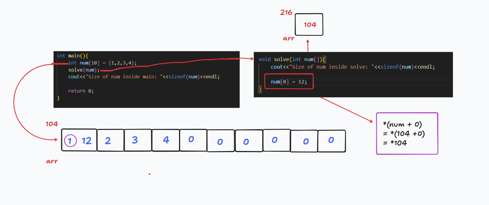

# C++ Pointer 🚀

## 📝 Symbol Table
- ✨ There is a data structure known as the **symbol-table** that stores variable names and their values in a map.
- ⚖️ The **address-of operator** (`&`) is used to display addresses, which are shown in hexadecimal format.

### 💡 Example:
```cpp
int x = 10;
cout << x << endl;  // 10
cout << &x << endl; // 0x7fffbf7b3b7c
```
| Symbol Table |
|-------------|
| Variable Name, Address |
| x, 0x7fffbf7b3b7c |

## 🔮 Pointers
- ⚙️ A **pointer** is a variable that stores the memory address of another variable.
- ♻️ It is used to share a memory address and perform efficient memory management.

### ✏️ Syntax:
```cpp
data_type *pointer_variable = &variable_name;
```
### 💡 Example:
```cpp
int x = 10;
int *p = &x;
cout << p << endl;  // 0x7fffbf7b3b7c
cout << *p << endl; // 10
```
- `int *p`: 👉 Declares `p` as a pointer to an integer.
- `&x`: 👉 Stores the address of `x` in `p`.
- `*p`: 👉 Dereferences `p` to get the value of `x`.

### 🎨 Pointer Access:
```cpp
int x = 10;
int *p = &x;
cout << *p << endl; // 10
```

### 🛠️ Important Concepts:
| Expression | Meaning |
|------------|----------|
| `x` | Value stored in `x` |
| `&x` | Address of `x` |
| `ptr` | Address stored in `ptr` |
| `&ptr` | Address of pointer `ptr` |
| `*ptr` | Value at the address stored in `ptr` |

## 📊 Size of a Pointer
- ⚡ The size of a pointer does **not** depend on the data type.
- ⚖️ It stores an **address**, which is always the same size (typically 8 bytes on a 64-bit system).

### 💡 Example:
```cpp
int x = 10;
char y = 'A';
int *p = &x;
char *q = &y;
cout << sizeof(p) << endl; // 8
cout << sizeof(q) << endl; // 8
```
### 📌 **Pointer Size in 64-bit vs 32-bit Systems** 
- **In a 64-bit system** 🖥️  
   - The memory addresses are **64 bits** (8 bytes) long.
   - This allows addressing up to **\(2^{64}\)** memory locations.
   - So, all pointers (irrespective of data type) occupy **8 bytes**.

- **In a 32-bit system** 💾  
   - The memory addresses are **32 bits** (4 bytes) long.
   - This allows addressing up to **\(2^{32}\)** memory locations.
   - So, all pointers occupy **4 bytes**.

### 📌 **Why Same Size for Different Data Types?**
Pointers store **memory addresses**, not values. The memory address size depends on the system's addressing capability, **not** the data type being pointed to.
- On a **64-bit system**, `sizeof(p)`, `sizeof(q)`, and `sizeof(r)` will all be **8 bytes**.
- On a **32-bit system**, they will all be **4 bytes**.
- The pointer size determines how much memory can be addressed.

## 📈 Why Use Pointers?
- 🏢 Memory sharing.
- ⚖️ Dynamic memory allocation.
- 🌐 Memory arithmetic operations.
- 📝 Accessing array elements efficiently.
- 🔄 Passing function arguments efficiently.

## ⚠️ Null Pointers
- ⛔ A **null pointer** points to `0`, meaning it does not reference any valid memory.

### 💡 Example:
```cpp
int *p = 0;
int *q = nullptr;
```

## 🔒 Good vs Bad Pointers
| Type | Description |
|------|-------------|
| ❌ **Bad Pointer** | Uninitialized pointer (may point to garbage) |
| ✅ **Good Pointer** | Initialized pointer (points to valid memory) |

### 💡 Example:
```cpp
int *p;      // Bad Pointer
int *q = 0;  // Good Pointer
```

## 💲 Pointer Arithmetic
- ➕ Pointers can be used in arithmetic operations.
- 🌐 Useful for **array traversal** and **dynamic memory manipulation**.

### 💡 Example:
```cpp
int a = 10;
int *p = &a;
cout << *p << endl;  // 10
*p = *p + 1;
cout << *p << endl;  // 11
```

## 🔄 Copying Pointers
- ♻️ One pointer can be assigned to another.

### 💡 Example:
```cpp
int a = 10;
int *p = &a;
int *q = p;
cout << *q << endl; // 10
```
## 📦 Pointers with Arrays
- 📚 Pointers and arrays are closely related in C++. 
- 📝 An array name is a **constant pointer** to the first element of the array.
- 🌐 Array elements can be accessed using pointers.
- Example: 
```cpp
int arr[] = {1, 2, 3, 4, 5};
cout<<arr<<endl;
cout<<&arr<<endl;
cout<<&arr[0]<<endl;
// All three will print the same address -> Base address of the array

int* ptr = arr;
cout<<ptr<<endl; // Base address of the array
cout<<&ptr<<endl; // Address of the pointer
cout<<*ptr<<endl; // Value at the base address of the array
```
### 💡 Remember:
- `&ptr` is the address of the pointer variable, not an array.
- `ptr` is the base address of the array.
- `arr` and `&arr` are the same (base address of the array).
- `ptr` and `&ptr` Both are different.
- `*arr` and `arr[0]` are the same (value at the base address of the array).
- `*(arr+1)` and `arr[1]` are the same (value at the next address of the array).
- `*(arr+i)`, `arr[i]`, and `i[arr]` are the same (value at the ith index of the array).
- 💡 **Example**:
```cpp
int arr[] = {1, 2, 3, 4, 5};
int* ptr = arr;
cout<<*ptr<<endl; // 1
cout<<*(ptr+1)<<endl; // 2
cout<<*(arr+2)<<endl; // 3
cout<<arr[3]<<endl; // 4
cout<<3[arr]<<endl; // 4
```

### 🪸 Diffrence between `array` and `pointer`:
| Array | Pointer |
|-------|---------|
| Size = number of elements | Size = 8 bytes |
| Cannot be reassigned | Can be reassigned |
| Cannot be incremented | Can be incremented |
| arr = arr + 1 ❌ (beacuse array is a const pointer) | ptr = ptr + 1 ✅ |
| arr++ ❌ | ptr++ ✅ |


## 🖨️ Pointer with Character Array
- When a pointer is point to a character array, and we want to print what values hold the pointer, then it gives values of whole character array not base address because `cout` has different implementation for `int` and `char` array (overloaded function for `char*` which prints the whole string). For `int` array it prints the base address and for `char` array it prints the whole string.
- 💡 **Example**:
```cpp
char ch[] = "Binary";
char* c = arr;
cout<<c<<endl; // Binary
```
### 💡 Remember:
- `ch` gives the whole character array `"Binary"`.
- `&ch` gives the base address of the character array.
- `ch[0]` gives the first character of the character array.
- `&c` gives the address of the pointer variable.
- `*c` gives the first character of the character array `ch`.
- `c` whole character array `"Binary"`.
- `c+2` gives the substring `"nary"`.
- `*(c+2)` gives the character `'n'`.

### ✅ Good and ❌ Bad Pointers with Arrays
- **Good Pointer**: Points to a valid memory location.
- **Bad Pointer**: Points to an invalid memory location.

| Good Practice ✅ | Bad Practice ❌ |
|---------------|--------------|
| `char ch[] = "Binary;` | `char* c = "Binary";` |
| temp storage = "Binary" | temp storage = "Binary" |
| memory change to storage of `ch` array | C Pointer store address of temp storage and here we don't know it how long work |

## 🎈 Pointer with Function 
- 📌 Pointers can be passed as arguments to functions.
- 🔄 This allows the function to modify the value of the variable passed.
- 💡 Example:
```cpp
void increment(int* p) {
   *p = *p + 1;
}
int main() {
   int x = 10;
   increment(&x);
   cout << x << endl; // 11
}
```
- 📚 Array can also be passed as an argument to a function.
- 💡 Example:
```cpp
void solve(int arr) {
   cout<<sizeof(arr)<<endl; // 8
}
int main() {
   int arr[] = {1, 2, 3, 4, 5};
   solve(arr);
   cout<<sizeof(arr)<<endl; // 20
}
```
☠️ `Reason`: Here difference in size beacuse we pass the array as an argument to `solve` function, and array is passed as reference to the function, so it gives the size of the pointer `num` not the size of the array `num`.



## 🎭 Double Pointer
- 🌐 A **double pointer** is a pointer that points to another pointer.
- 🗂️ It is used to store the address of a pointer variable.
- 💡 Example:
```cpp
int n = 56;
int* p = &n;
int** q = &p;

cout<<n<<endl; // value of n
cout<<&n<<endl; // address of n
cout<<p<<endl; // values of p (address of n)
cout<<&p<<endl; // address of p
cout<<*p<<endl; // value stored at address stored in p (Value of n)
cout<<q<<endl; // value of q (address of p)
cout<<&q<<endl; // addredd of q
cout<<*q<<endl; // value stored at address store in q (value of p || address of n)
cout<<**q<<endl; // value of n
```
```
328            216          104
   -----          -----         ----
   |126|   =>     |104|   =>    |12|
   -----          -----         ----
  q              p             n
```

## 💡 Remember:
- `n`: value of n
- `&n`: address of n
- `p`: values of p (address of n)
- `&p`: address of p
- `*p`: value stored at address stored in p (Value of n)
- `q`: value of q (address of p)
- `&q`: addredd of q
- `*q`: value stored at address store in q (value of p || address of n)
- `**q`: value of n

## 🔗 Reference variables
- 🔗 A **reference variable** is an alias for another variable i.e., same memory location but different names.
- 📋 There is no copy of the variable, it is just another name for the same memory location.
- 📝 Reference variables are declared using the `&` symbol.
- 🔄 Reference variables are used to modify the original variable.
- 📊 In the symbol table, the reference variable is stored with the same address as the original variable.
- 💡 Example:
```cpp
int x = 10;
int &y = x;
cout<<x<<endl; // 10
cout<<y<<endl; // 10
```
- Here `x` and `y` are the same memory location, so if we change the value of `x` then `y` also change and vice versa.

### 🤔 Why use reference variables?
- ❌ Cannot set a reference variable to null, but it is possible for pointers, making reference variables safer.
- 👽 Pointers are complex to understand, but reference variables are more readable.
- ⚡ Reference variables are more efficient than pointers.

## 😐 Pass by Value Vs 😎 Pass by reference
- **Pass by Value**: In this method, the value of the variable is passed to the function. So, the original value is not changed.
- 💡 Example:
```cpp
void increment(int x) {
    x = x + 1;
}
int main() {
    int x = 10;
    increment(x);
    cout << x << endl; // 10
}
```
- **Pass by Reference**: In this method, the reference of the variable is passed to the function. So, the original value is changed.
- Example:
```cpp
void increment(int &x) {
    x = x + 1;
}
int main() {
    int x = 10;
    increment(x);
    cout << x << endl; // 11
}
```

# Problems
1. What will be the output ?
```cpp
What will be the output ?
float f = 10.5;
float p = 2.5;
float* ptr = &f;
*ptr = p;
cout<<*ptr<<" " <<f<< " " <<p<<endl;
```