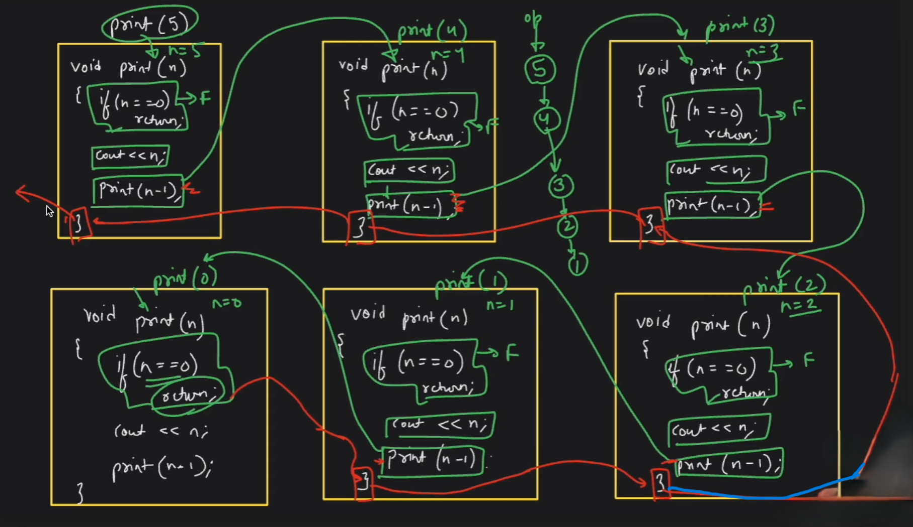
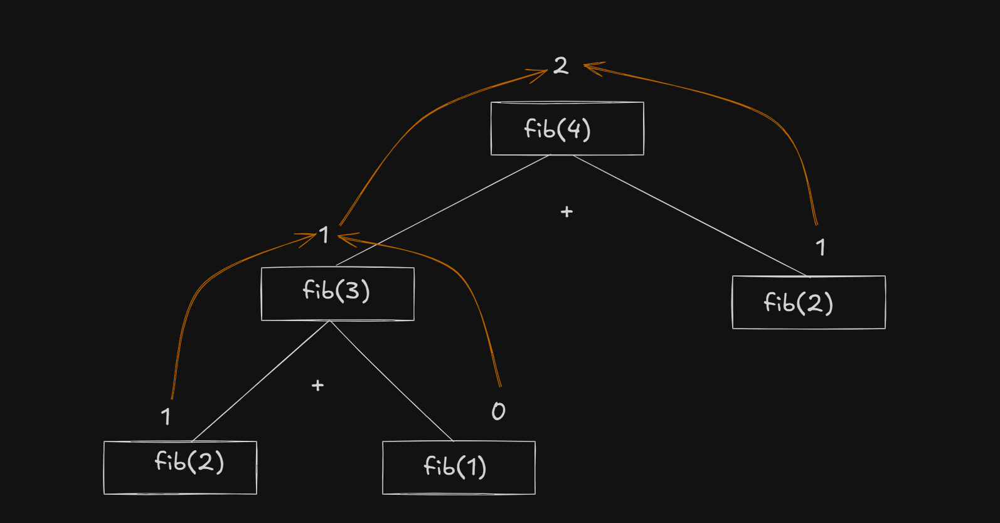

# Recursion 🚀
- When a function calls itself directly or indirectly, it is called `recursion`. 
- The function which calls itself is called `recursive function`.
- i.e. A big problem is divided into same type smaller problems and then solved recursively.
- **Example**: let you want to calculate 2^n, you can calculate it by multiplying 2 n times. But you can also calculate it by multiplying 2 with 2^(n-1).
    - 2^n = 2 * 2^(n-1)
    - f(n) = 2 * f(n-1)

- In recursion a problem statement is depends on the smaller problem by a relation / formula.

## Recursion Code Structure
There are 3 parts in a recursive function:
- **Base Condition**: The condition when the recursion will stop.
- **Recursive Call**: The function calls itself.
- **Processing**: Calculation or operation on the result of the recursive call.

```cpp
void recursiveFunction(){
    // Base Condition
    if(baseCondition){
        return;
    }

    // Recursive Call
    recursiveFunction();

    // Processing
    // Do some processing
}
```

## Types of Recursion
- **Head Recursion**: When the recursive call is written before the processing part.

```cpp
void recursiveFunction(){
    // Base Condition
    if(baseCondition){
        return;
    }

    // Recursive Call
    recursiveFunction();

    // Processing
    // Do some processing
}
```

- **Tail Recursion**: When the recursive call is written after the processing part.

```cpp
void recursiveFunction(){
    // Base Condition
    if(baseCondition){
        return;
    }

    // Processing
    // Do some processing

    // Recursive Call
    recursiveFunction();
}
```

- There **Base Condition** and **Recursive Call** are mandatory, but **Processing** is optional.

## Recursive Call Stack
- When a function is called, a call stack is created that manages the function calls.
- Stack is a data structure that follows LIFO (Last In First Out) principle.
- **Example**: let you write a recursive function to reverse counting from n to 1.
```cpp
void printReverse(int n){
    // Base Condition
    if(n == 0){
        return;
    }

    // Processing
    cout << n << " ";

    // Recursive Call
    printReverse(n-1);
}
```
- **Call Stack**:

    | **Stack Frame** | **Value of n** | **Output** | **Next Action** |
    | --- | --- | --- | --- |
    | Frame 1 | 5 | 5 | Call reverseCount(4) |
    | Frame 2 | 4 | 4 | Call reverseCount(3) |
    | Frame 3 | 3 | 3 | Call reverseCount(2) |
    | Frame 4 | 2 | 2 | Call reverseCount(1) |
    | Frame 5 | 1 | 1 | Call reverseCount(0) |
    | Frame 6 | 0 | - | Return (Base case) |

- *See the image for visualization* 

    

## Recursive Tree
It is a tree representation of the recursive calls there leaf nodes are the base condition and internal nodes are the recursive calls.
- *See the image for visualization.*

    

## Magical line of Recursion
**Solve a single problem, Rcursion will handle ramaining problems.**

## Problems
- Reverse counting from n to 1.
- Factorial of a number.
- 2 raised to the power n.
- Fibonacci series.
- Print Digits of a number.
- Climb stairs.
- Max number in an array.
- Find an element in an array.
- Find the first and last occurrence of an element in an array.

